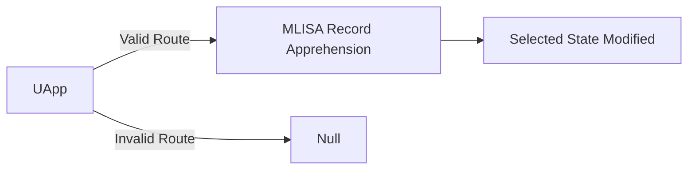

McQuilling Search Client Documentation
Needs to be updated to reflect last iteration of SearchClientApp
Angular Router and Microsoft Azure Directory

1. When rendering any route rendered by Angular’s Route, Microsoft Authentication Library
requires active credentials within the Microsoft Azure Active Directory. On load, it will first
check local storage for any cookies associated with Microsoft Azure Active Directory.

```
A. If no user is found, a McQuilling Branded Azure pop-up will prompt you to enter
your McQuilling credentials; when proper credentials are provided, the client will
automatically load.
```
```
B. If credentials are cookied within local storage, and then the client will automatically
load.
```
Secure Connection to McQuilling MLISA API

1. Once the client is loaded, the client will send credentials to the McQuilling MLISA ALI in
exchange for a custom JSON Web Token, which is signed and checked by the MLISA API on
every request to the server.

```
A. This token is critical to performing any action on the client; the client renders data
returned from the API. Every call for data requires this encrypted key for authentication
and authorization; without this key, a 401 message will be returned.
```
```
B. JSON Web Token
```
I. This token holds encrypted data like:

- Email of the user
- Hashed password of the user
- Users permissions 
- Signer's Domain
- Signer's secret
Search Clients State Management System (NGRX/FLUX PATTERN)
1. The Search Client follows the Flux pattern for state management, which is as follows:
    A. The View's interface dispatches Actions
    B. Those Action have a Type and a Payload
    C. Reducers act like a switch statement, when a type is matched, the state is spread and adds the payload to the current state
    D.The State is sent to the store to be redistributed to the View
    * Additionially Effects can be called to chain multiple actions and services together

    Making an call to server(example)
    A. Interface initiates action to make a call to server with Query Parameters as a payload
    B. An Effect detects an Action is disptached and intercepts payload to be sent to service
    C. Service Calls a functions to make a call to the server and returns an Observerable 
    D. Orginal Effect recieves Observable and Maps to appropriate action with the Oberserable as a payload
    E. Action is called and reducer responses with appropriate function
    F. State is changed and View is updated
    
Search Client Basics

```
Top Navigation
```
1. When the page is loaded, a blue navigation bar with several input fields will take up
    the top portion of the page.

A. Search Field Type
I. To the fare left; a drop-down menu is visible with several search types:

- Post-Fixtures
- Vessels
- Ports


II. Each type corresponds with the data type returned from the search.

B. Query Fields
I. Each field queries and filters the data returned based on the data in the
input fields. Enter as many or as few fields as needed for your query;
each search will return a paginated response from the API.
(McQuilling.Utils.Models.PagingModel)

II. McQuilling PagingModel Response
PageCount: Integer

- Total number of pages in search
PageIndex: Integer
- Current page index; on a new search, this is initialized to 1
SearchModel: Custom Class
    - The SearchModel class contains all parameters that are submitted
    to API in the request
DataType: String
- This tells the client what type of data the payload contains
Data: Array of Type "DataType"
- This is the payload of queried data to be displayed

Rendered UI

1. Below the navigation; the home dashboard is split into the three main parts: Result
Bar(renders search results), Record Display(renders individual records), Folder
Display(renders Folders)

A. Result Bar
I. Locating the Result Bar:

- The Result bar is a grey component located to the left; that width takes
up about a fourth of the screen.
II. Using the Result Bar:
- A paginated response will populate this component with =<10 search
results. If no search results populate, then that query did not return any search
results. These search results are sorted first alphabetically then chronologically;
you can then navigate through the current results by clicking on them and
previewing the record. When a search result is hovered or clicked, it becomes
blue. When a search result is finally selected, it is moved to the
*SelectedItemContext within the *Globalappcontext so that the whole record can
be properly viewed and manipulated. Finally, the large "X" and Hamburger Icon
can toggle the visibility of the Result Bar.

B. Record Display
I. Locating the Record Display

- The Record Display divides the UI horizontally in half; it will take up the
upper half of the screen. When the client initially loads, this component should be


blank because there is no data located within the *SelectedItemContext within the
*Globalappcontext.
II. Using the Record Display

- This section will render all of the data that is currently selected from a
past database query within the Result bar.

C. Folder Display
I. Locating the Folder Display

- The Folder Display divides the UI horizontally in half; it will take up the
lower half of the screen.
II. Using the Folder Display
- This section renders folders that will be saved within the database; users
will have the ability to create new folders and add to the current one from this
screen

*Globalappcontext Service

1. This is the primary context service for the whole client; all micro-services and data are stored
here. They are then distributed to all components via a singleton instance of the
Globalappcontext service.

A. Micro-Services
I. Token Service

- This service is created when the Globalappcontext is initialized
    - This service performs a request for the token when created and stores it in
    a private token model, where it will have access to multiple parts of the
    token.
    - The Token service also checks the validity of the token before any
    subsequent request and renews it automatically if need be
II. Database Query Service
    - This Service makes queries to different routes depending on the set
    Search Field Type
    - This uses Angular built-in HttpClient which uses subscription for error
    handling
    - The subscription will save the response into two parts of the
    Globalappcontext
- The search results are saved to a private typed array list
- The PagingModel is saved to the Globalappcontext's Paging Models
    - When a successful response, the subscription will save the private typed
    array to the GlobalContext via the Data Switch and change the status code
    of the context from "pending" to "returned"

```
III. Data Switch
```
- The Data switch looks to the current GlobalContextType to map the
private typed data array to a public GlobalContext

B. Stored Contexts


I. In the Globalappcontext multiple contexts are stored for easy access

GlobalContext:

- This contains the last queried search results from this session; it is an
Array List of no specific type. This is the data that the Result bar will
render after a call to the database
GlobalContextStatus :
- This indicates the Globalappcontext Services current status, either
"returned" or "processing"
GlobalContextType:
- This set the data type of the current GlobalContext
DataType array lists:
- These are private arrays that only Globalappcontext has access to; data is
modeled properly and placed into these stricter array lists. This process
prevents mistyping and polluting the GlobalContext
PageModel Context:
- The PageModel helps the client have reference to the complete size of
the search results and allows them to navigate through the results
SelectedItem Context:
- This retrieves a single item to be displayed by the Record Display

# McQuilling uApplications

Each uApp ( Micro Application) is based around a Mcquilling business object, each Mcquilling business record is stored with in the one of many tables with in the MLISA database. When one of the uApps routes is accessed, an action is fired after a MLISA token is retrieved. This action is intercepted by the Business Objects effect file, a function then checks the route and the route's parameters. Each route parameter contain the GUID related with the Business Object assigned by the MLISA Database. The Effect then fires an action with the GUID as a payload, the MLISA API is queried through the Business Object's Service file. If successful, an Action will contain the Object record as a payload. The Business Objects reducers switch statement will then append the Selected\<Business Object>  State object.


### Post Fixture uApp Initialization Example
```javascript
loadPostFixtureRecord$  =  createEffect(()=>
this.actions$.pipe(
	ofType(TokenObtained),
		map((action)  =>{
			if(this.router.url.split('/')[1] ==  'post_fixtures'){
				return PostFixtureActions.PostFixtureRecordShare({PostFixtureID:this.router.url.split('/')[2]});
			}
			return  PostFixtureActions.PostFixtureRecordPass();
		})
	)
)
```
+ Most Business Objects have several other tables associated with them, so the state will be appended multiple times during its lifecycle.

## Port uApp


When a Port Record is returned by the MLISA API several other tables are queried on the behalf of the returned record. Each one of these records is contained within the Port Record Model as a nullable object until the record is returned and appends the original state.
### OpenLayers Map
Open Layers is a mapping package that takes the Port Longitude and Latitude and creates a Map with the help of OpenStreets and OpenSeas Tiles.
##### Documentation :
[OpenLayers Documentation](https://openlayers.org/en/latest/apidoc/)
#### Port Costs
A `PortCostGroup` is return from the `PortCost_Search/` route of the MLISA API, this is hash-table containing arrays of `PortCostModels`. A `PortCostModel` is a model of Port Cost which would be entered by our Operations Team. Port ID, Cost , Ship type and the date entered would be contained with in that entry. Each array within the hash-table would contain one ship type and would be sorted in chronological order.
### Terminals
Terminals within a Port are queried after the retrieval of the initial Port information, the  `PortTerminal_Search/` returns an array of `PortTerminalModels`. Each `PortTerminalModel` contains a Port GUID , Terminal name and Terminal notes which are essential to our Operation Teams world wide.
### Near By Ports
Near by ports contains an array of minified port objects, these ports are returned by the MLISA API's  `NearByPorts/` route based on the country code of the original port record. 
### Email Attachments and Folders
`MLISAObjectFolder` are Folders attached to MLISA Business Objects, and within these attached folders sit corresponding `MLISAObjectMessages`. When a Port Record is retrieved; one of the first corresponding calls to the server will be for the Folder Context of a Port Record. This will be represented by an Array of `MLISAObjectFolders` called `FolderContext`, this of course is a 2D Array containing `MLISAObjectMessages`.  The `FolderContext`  array is sorted in descending order by the number of messages contained in each folder via a bubble sort on the backend. Once the `FolderContext` is received a `FolderSearchModel` is created containing the first Folder's ID and page index; which is 1. Then `MLISAObjectFolderMessages/?` is set a GET request with the `FolderSearchModel` as the URI Query parameters, if there are Messages associated with the `MLISAObjectFolder` being queried a Pagination Model of 'MLISAObjectMessages will be returned. If no emails are found being connected with the Folder ID then an empty Paging Model will be created and passed to the State instead.
#### Creating New Folders
Once the `NewFolder` function is called a `AddNewPortFolder` action will be called with the payload of the newly created `MLISAObjectFolder`. The Port Effect will call the a Port Service function called `CreateNewFolder` which takes a `MLISAObjectFolder` as a parameter. A POST request will be sent to `NewMLISAObjectFolder/` with the newly created Folder in the body. On a successful request the `FolderContext` will be re-fetched and appended.
#### Adding New Files
The `OnDrop` method is called when a Email Message is dragged and dropped on to a Email workspace. This will dispatch `addToPortFolder` action with the item details in its payload. This will subsequently make a POST request to McQuilling Partners Microsoft Flow API, on completion of that request a `FolderSearchModel` will be sent for a new Paging Model of the current Folder.
## Company uApp
### Email Attachments and Folders
`MLISAObjectFolder` are Folders attached to MLISA Business Objects, and within these attached folders sit corresponding `MLISAObjectMessages`. When a Company record is retrieved; one of the first corresponding calls to the server will be for the Folder Context of a Company Record. This will be represented by an Array of `MLISAObjectFolders` called `FolderContext`, this of course is a 2D Array containing `MLISAObjectMessages`.  The `FolderContext`  array is sorted in descending order by the number of messages contained in each folder via a bubble sort on the backend. Once the `FolderContext` is received a `FolderSearchModel` is created containing the first Folder's ID and page index; which is 1. Then `MLISAObjectFolderMessages/?` is set a GET request with the `FolderSearchModel` as the URI Query parameters, if there are Messages associated with the `MLISAObjectFolder` being queried a Pagination Model of 'MLISAObjectMessages will be returned. If no emails are found being connected with the Folder ID then an empty Paging Model will be created and passed to the State instead.
#### Creating New Folders
Once the `NewFolder` function is called a `AddNewCompanyFolder` action will be called with the payload of the newly created `MLISAObjectFolder`. The Company Effect will call the a Company Service function called `CreateNewFolder` which takes a `MLISAObjectFolder` as a parameter. A POST request will be sent to `NewMLISAObjectFolder/` with the newly created Folder in the body. On a successful request the `FolderContext` will be re-fetched and appended.
#### Adding New Files
The `OnDrop` method is called when a Email Message is dragged and dropped on to a Email workspace. This will dispatch `addToCompanyFolder` action with the item details in its payload. This will subsequently make a POST request to McQuilling Partners Microsoft Flow API, on completion of that request a `FolderSearchModel` will be sent for a new Paging Model of the current Folder.
## Post Fixture uApp

Post Fixture Business Objects are contractual agreements between multiple parties with several accessory MLISA database tables. After the initial call for the base `PostFixtureRecord` multiple corresponding calls for the accessory data will occur.
### Companies 
After `PostFixtureSelection` action is dispatched; an effect will use the Post Fixture Service to obtain the Company and Effective Control attached to the Post Fixture.  Then depending on the success of the API request each attached Company will be appended individually.
### Itinerary Updates
Itinerary Updates are updates provided by our Operation Team on the status of a Post Fixture Record. Itinerary Updates are not only a history of the Post Fixture Record but also can change details contained within a Post Fixture. When a Post Fixture is initially requested only the most recent itinerary update is returned, a subsequent called to `pf_ItineraryUpdateList/?` which returns a paginated array of Itinerary Updates. A user can access these updates via the Itinerary History page of the Post Fixture uApp. From this page a user can either confirm an update; which creates new copy of the Itinerary Update with an updated Timestamp or a user can choose to create a new update.
If a user was to choose to create a new Itinerary Update they would directed to the Post Fixtures uApp's Itinerary Update page. Here an Operator can fill out what updated fields they would like to submit and a spread operator will combined these updated with the last submitted update. 
+ further research needs to be done about this functionality 
### Email Attachments and Folders
`PostFixtureFolders` are Folders attached to Post Fixture Business Objects, and within these attached folders sit corresponding `PostFixtureMessages`. When a Post Fixture Record is retrieved; one of the first corresponding calls to the server will be for the Folder Context of a Post Fixture Record. This will be represented by an Array of `PostFixtureFolders` called `FolderContext`, this of course is a 2D Array containing `PostFixtureMessages`.  The `FolderContext`  array is sorted in descending order by the number of messages contained in each folder via a bubble sort on the backend. Once the `FolderContext` is received a `FolderSearchModel` is created containing the first Folder's ID and page index; which is 1. Then `pf_FixtureFolder_Content/?` is sent a GET request with the `FolderSearchModel` as the URI Query parameters. If there are Messages associated with the `PostFixtureFolder` being queried; a Pagination Model of `PostFixtureMessages` will be returned. If no emails are found being connected with the Folder ID then an empty Paging Model will be created and passed to the State instead.
#### Creating New Folders
Once the `NewFolder` function is called a `PostFixtureFolderCreation` action will be called with the payload of the newly created `MLISAObjectFolder`. The Company Effect will call the a Company Service function called `CreateNewFolder` which takes a `MLISAObjectFolder` as a parameter. A POST request will be sent to `pf_FixtureFoldersSearchApp/` with the newly created Folder in the body. On a successful request the `FolderContext` will be re-fetched and appended.
#### Adding New Files
The `OnDrop` method is called when a Email Message is dragged and dropped on to a Email workspace. This will dispatch `addToFolder` action with the item details in its payload. This will subsequently make a POST request to McQuilling Partners Microsoft Flow API, on completion of that request a `FolderSearchModel` will be sent for a new Paging Model of the current Folder.
